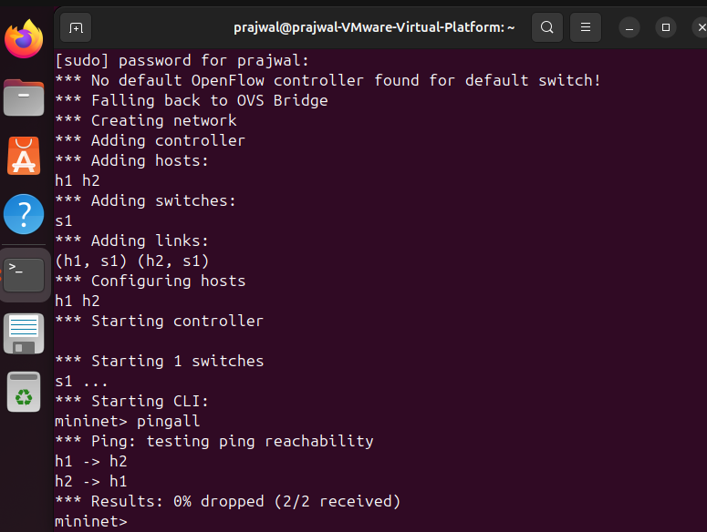
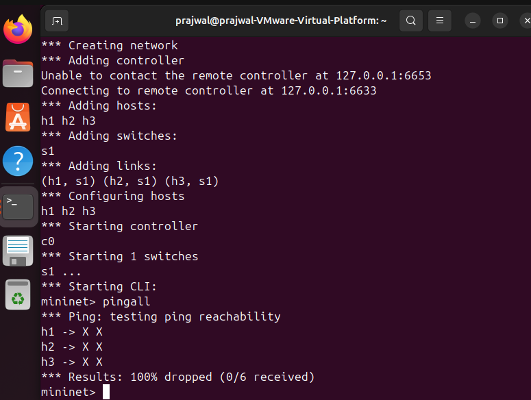
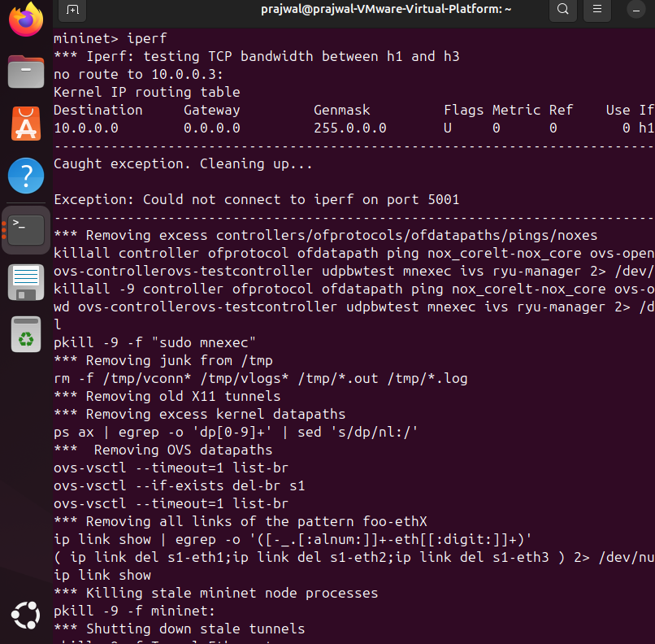
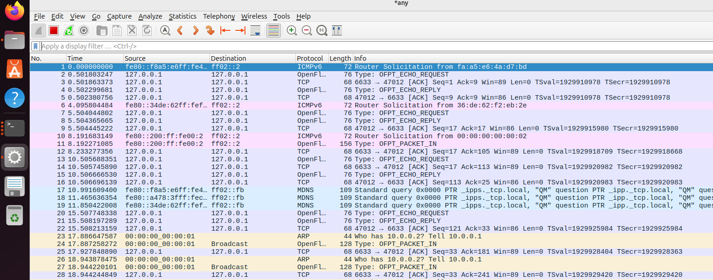
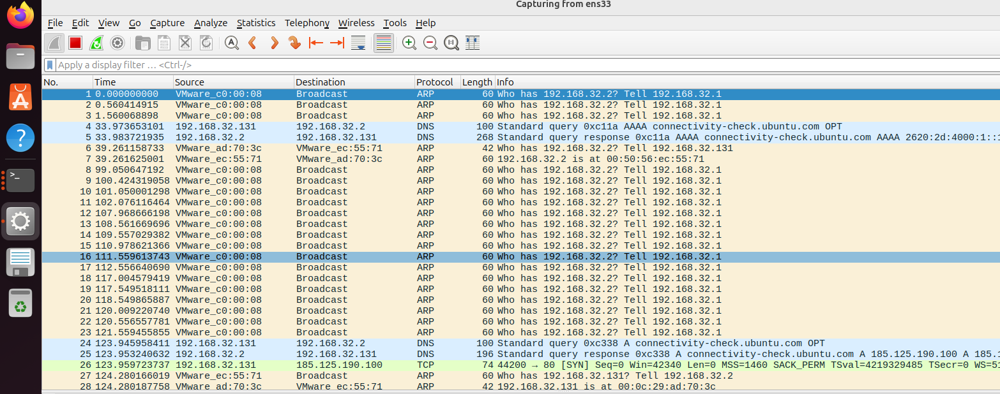
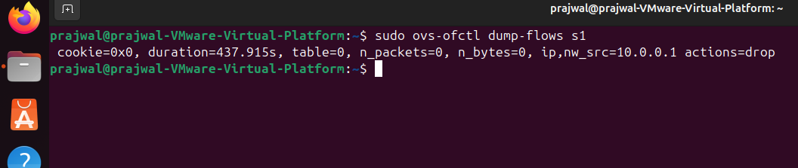

# Packet Drop Simulator using SDN (Mininet + POX)

## 📌 Problem Statement

Simulate packet loss in a network using Software Defined Networking (SDN) by applying OpenFlow flow rules to selectively drop packets.

---

## ⚙️ Tools Used

* Mininet
* POX Controller
* Wireshark
* iperf

---

## 🚀 Setup & Execution

### 1. Start POX Controller

cd ~/pox
./pox.py misc.packet_drop

### 2. Start Mininet

sudo mn --topo single,3 --controller=remote

### 3. Test Connectivity

pingall

### 4. Test Throughput

h2 iperf -s &
h1 iperf -c 10.0.0.2

---

## 🎯 Expected Output

* Traffic from selected host is dropped
* Ping fails for that host
* iperf shows no connection
* Wireshark shows packets but no delivery

---

## 🔬 Testing & Validation

* Scenario 1: Normal network (no drop) → all success
* Scenario 2: Packet drop enabled → selective failure
* Verified using ping, iperf, and Wireshark

---

## 📸 Proof of Execution

(Screenshots added below)

* Ping results
* Wireshark capture
* Flow table

## 📸 Proof of Execution

### 🔹 Normal Network (0% drop)

### 🔹 Packet Drop Result (100% drop)

### 🔹 Iperf Test (Fail)

### 🔹 ICMP Packets (Wireshark Filter)

### 🔹 Wireshark Capture

### 🔹 Flow Table

---

## 🧠 Conclusion

This project demonstrates how SDN controllers can dynamically control network behavior by applying flow rules.
